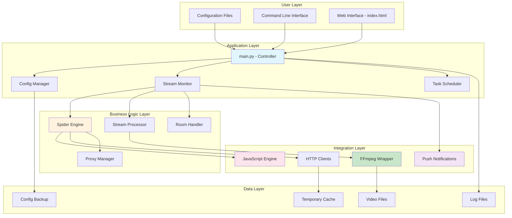
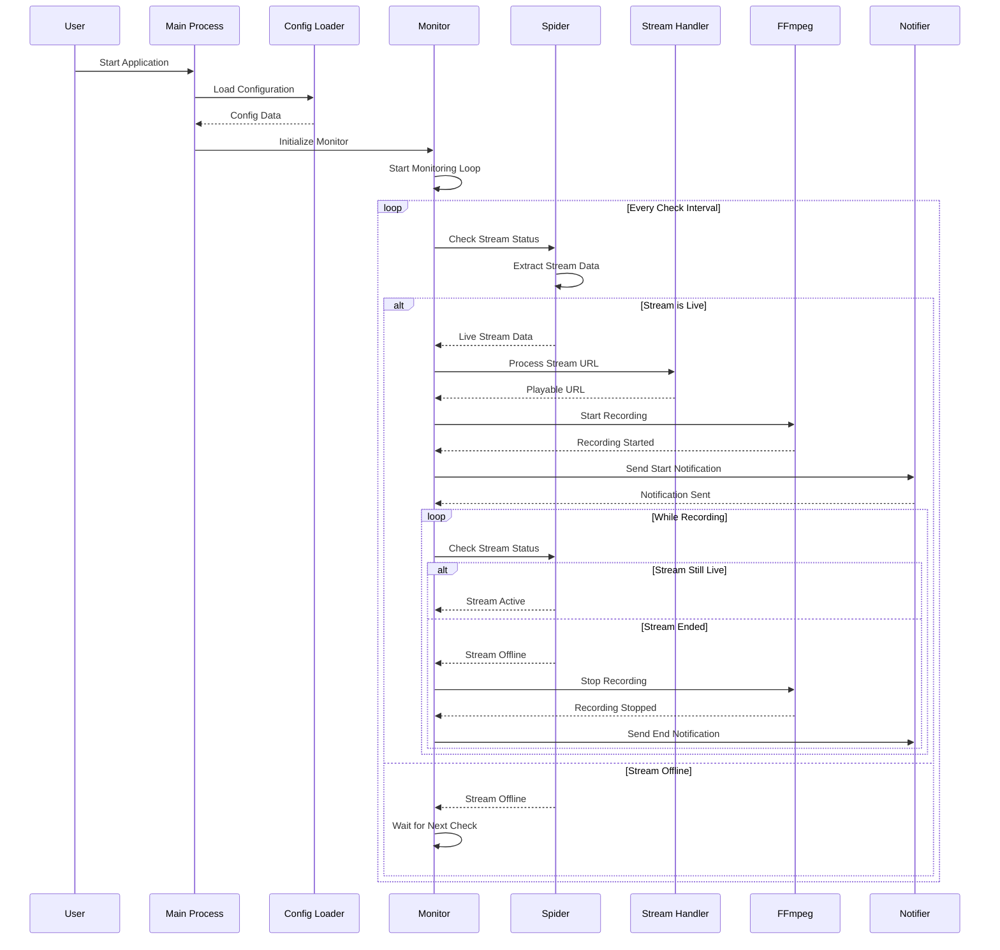
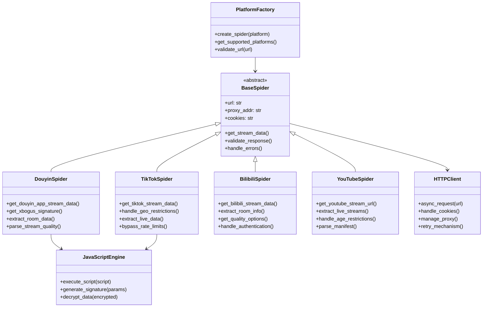
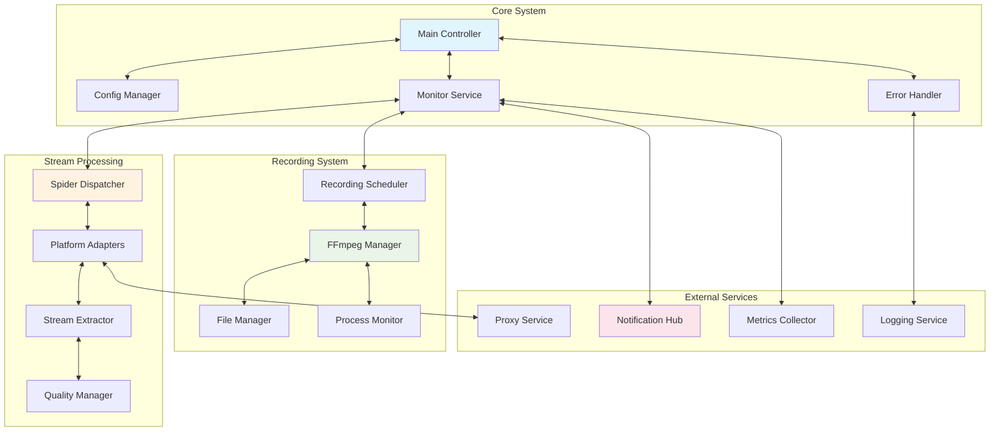
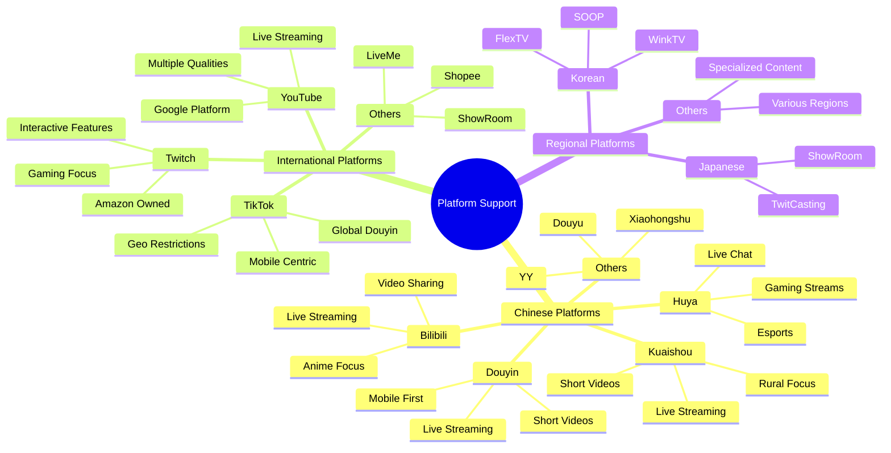
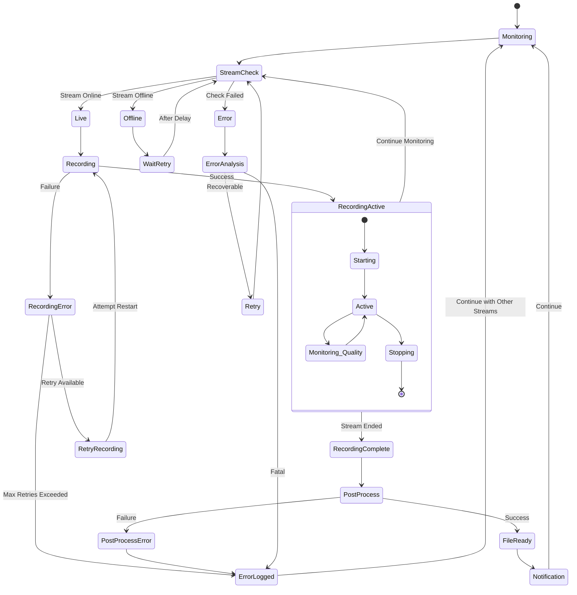
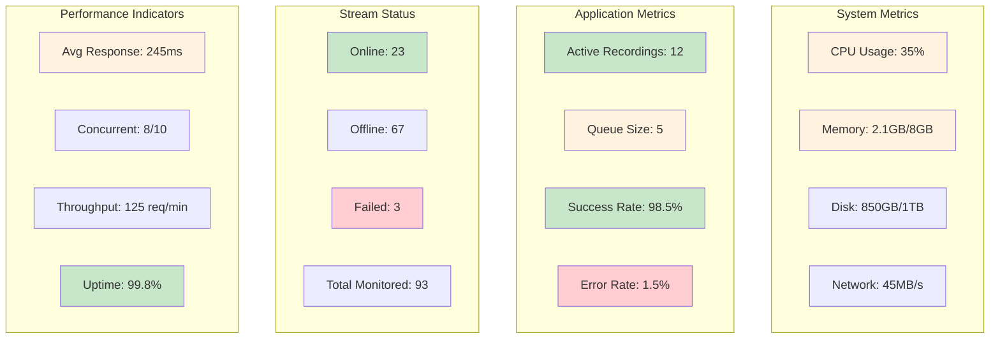
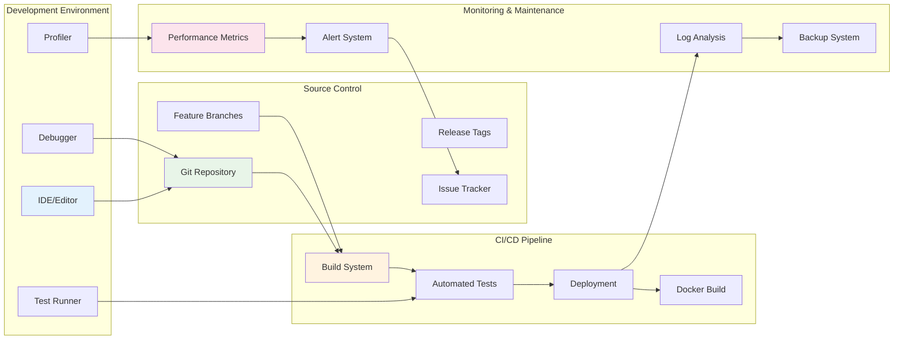

```mermaid
flowchart LR
    subgraph "Input Sources"
        URL_CONFIG[URL Config File]
        MANUAL_INPUT[Manual URL Input]
        API_INPUT[API Input]
    end
    
    subgraph "URL Processing"
        URL_PARSER[URL Parser]
        PLATFORM_DETECTOR[Platform Detector]
        URL_VALIDATOR[URL Validator]
    end
    
    subgraph "Data Extraction"
        SPIDER_ENGINE[Spider Engine]
        JS_ENGINE[JavaScript Engine]
        HTTP_CLIENT[HTTP Client]
    end
    
    subgraph "Stream Processing"
        STREAM_ANALYZER[Stream Analyzer]
        QUALITY_SELECTOR[Quality Selector]
        URL_GENERATOR[Stream URL Generator]
    end
    
    subgraph "Recording Engine"
        FFMPEG_CONTROLLER[FFmpeg Controller]
        PROCESS_MANAGER[Process Manager]
        FILE_HANDLER[File Handler]
    end
    
    subgraph "Output Processing"
        VIDEO_CONVERTER[Video Converter]
        FILE_ORGANIZER[File Organizer]
        METADATA_EXTRACTOR[Metadata Extractor]
    end
    
    subgraph "Notification System"
        MESSAGE_FORMATTER[Message Formatter]
        MULTI_CHANNEL_SENDER[Multi-Channel Sender]
        DELIVERY_TRACKER[Delivery Tracker]
    end
    
    URL_CONFIG --> URL_PARSER
    MANUAL_INPUT --> URL_PARSER
    API_INPUT --> URL_PARSER
    
    URL_PARSER --> PLATFORM_DETECTOR
    PLATFORM_DETECTOR --> URL_VALIDATOR
    URL_VALIDATOR --> SPIDER_ENGINE
    
    SPIDER_ENGINE --> JS_ENGINE
    SPIDER_ENGINE --> HTTP_CLIENT
    SPIDER_ENGINE --> STREAM_ANALYZER
    
    STREAM_ANALYZER --> QUALITY_SELECTOR
    QUALITY_SELECTOR --> URL_GENERATOR
    URL_GENERATOR --> FFMPEG_CONTROLLER
    
    FFMPEG_CONTROLLER --> PROCESS_MANAGER
    PROCESS_MANAGER --> FILE_HANDLER
    FILE_HANDLER --> VIDEO_CONVERTER
    
    VIDEO_CONVERTER --> FILE_ORGANIZER
    FILE_ORGANIZER --> METADATA_EXTRACTOR
    
    SPIDER_ENGINE --> MESSAGE_FORMATTER
    MESSAGE_FORMATTER --> MULTI_CHANNEL_SENDER
    MULTI_CHANNEL_SENDER --> DELIVERY_TRACKER
    
    style URL_CONFIG fill:#e3f2fd
    style SPIDER_ENGINE fill:#fff3e0
    style FFMPEG_CONTROLLER fill:#e8f5e8
    style MESSAGE_FORMATTER fill:#fce4ec
```

# DouyinLiveRecorder - Visual Architecture Diagrams

This document contains detailed visual diagrams explaining the architecture and workflow of the DouyinLiveRecorder project.

## 🏗️ System Architecture Overview

## 🔄 Recording Workflow Process

## 🕷️ Spider Module Architecture

## 📊 Data Flow Architecture

## 🔧 Component Interaction Diagram

## 🌐 Platform Support Matrix

## 🔄 Error Handling Flow

## 📈 Performance Monitoring Dashboard

## 🛠️ Development Architecture

---

*These diagrams provide a comprehensive visual understanding of the DouyinLiveRecorder architecture, from high-level system overview to detailed component interactions.*
