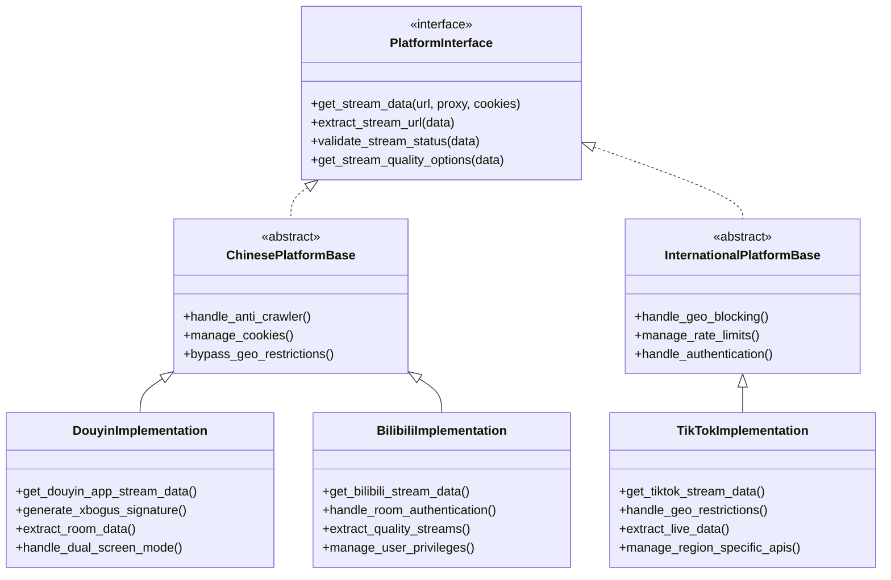
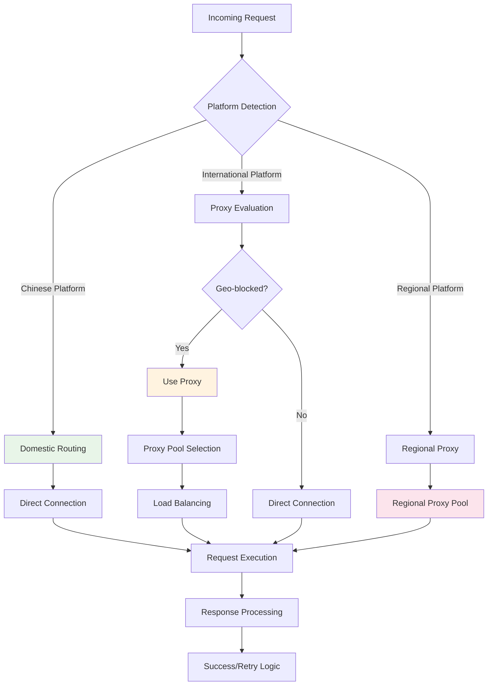
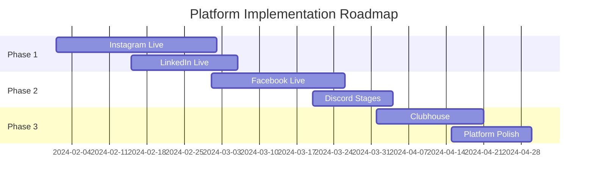

# Platform-Specific Implementations

This document details how DouyinLiveRecorder implements support for different streaming platforms, including their unique challenges and solutions.

## 🌍 Platform Categories

### Chinese Platforms (国内平台)
- **Douyin** (抖音) - ByteDance's short video and live streaming platform
- **Kuaishou** (快手) - Competing short video platform
- **Bilibili** (B站) - Video sharing and ACG (Anime, Comics, Games) platform
- **Huya** (虎牙) - Gaming-focused live streaming platform
- **Douyu** (斗鱼) - Gaming and entertainment streaming platform
- **Xiaohongshu** (小红书) - Lifestyle and social commerce platform

### International Platforms
- **TikTok** - Global version of Douyin
- **YouTube** - Google's video platform with live streaming
- **Twitch** - Amazon's gaming-focused streaming platform
- **Shopee** - E-commerce platform with live shopping features

### Regional Platforms
- **SOOP** (Korea) - Formerly AfreecaTV
- **WinkTV** (Korea) - Korean streaming platform
- **FlexTV** (Korea) - Korean entertainment streaming
- **TwitCasting** (Japan) - Japanese live streaming service

## 🔧 Implementation Architecture



## 🎯 Platform-Specific Challenges & Solutions

### 1. Douyin (抖音) Implementation

#### Challenges:
- **X-Bogus Algorithm**: Complex signature generation for API requests
- **Frequent API Updates**: ByteDance regularly updates their protection mechanisms
- **Cookie Requirements**: Live streaming requires authenticated cookies
- **Dual Screen Mode**: Special handling for dual-screen live streams

#### Solutions:
```javascript
// X-Bogus signature generation (simplified)
function generateXBogus(query, userAgent) {
    // Complex algorithm involving:
    // - Query parameter manipulation
    // - User agent fingerprinting
    // - Timestamp-based calculations
    // - MD5 and other hashing operations
    return signature;
}
```

```python
# Douyin stream extraction implementation
async def get_douyin_app_stream_data(url: str, proxy_addr: str = None, cookies: str = None) -> dict:
    # Step 1: Extract room ID and user ID from URL
    room_id = extract_room_id(url)
    sec_uid = await get_sec_user_id(url)
    
    # Step 2: Generate X-Bogus signature
    xbogus = await get_xbogus(api_url, headers)
    
    # Step 3: Make authenticated API request
    stream_data = await api_request(api_url + f"&X-Bogus={xbogus}")
    
    # Step 4: Extract stream URLs and quality options
    return parse_stream_response(stream_data)
```

#### Unique Features:
- **Multiple Stream Qualities**: 原画, 超清, 高清, 标清, 流畅
- **Connection Mode Detection**: Detects if streamer is in dual-screen mode
- **Real-time Chat Integration**: Can extract live chat data
- **Mobile-First Design**: Optimized for mobile streaming

### 2. TikTok Implementation

#### Challenges:
- **Geo-blocking**: Different APIs for different regions
- **Rate Limiting**: Aggressive rate limiting for automated requests
- **Content Restrictions**: Age-gated and region-restricted content
- **API Variations**: Different endpoints for different markets

#### Solutions:
```python
async def get_tiktok_stream_data(url: str, proxy_addr: str = None, cookies: str = None) -> dict:
    # Handle different TikTok URL formats
    if "live" in url:
        username = extract_username_from_live_url(url)
    else:
        username = extract_username_from_profile_url(url)
    
    # Use region-appropriate API endpoint
    api_endpoint = get_regional_api_endpoint(proxy_addr)
    
    # Implement rate limiting and retry logic
    with RateLimiter(max_requests=10, time_window=60):
        response = await make_request_with_retry(api_endpoint)
    
    return parse_tiktok_response(response)
```

#### Regional Considerations:
- **US/EU**: Stricter content policies, GDPR compliance
- **Asia-Pacific**: Different API endpoints and parameters
- **Proxy Requirements**: Essential for accessing region-locked content

### 3. Bilibili (B站) Implementation

#### Challenges:
- **Multiple Stream Types**: Live rooms, video premieres, special events
- **Quality Authentication**: Higher qualities require user authentication
- **Complex Room Types**: Different handling for official vs user rooms
- **Real-time Interaction**: Integration with danmaku (bullet comments)

#### Solutions:
```python
async def get_bilibili_stream_data(url: str, proxy_addr: str = None, cookies: str = None) -> dict:
    room_id = extract_bilibili_room_id(url)
    
    # Get room initialization data
    init_data = await get_room_init(room_id)
    
    # Handle different room states
    if init_data['live_status'] != 1:
        return create_offline_response(init_data)
    
    # Get stream URLs with quality options
    play_data = await get_room_play_info(room_id, cookies)
    
    # Parse quality streams
    quality_streams = parse_bilibili_qualities(play_data)
    
    return {
        'anchor_name': init_data['anchor_name'],
        'is_live': True,
        'stream_url': quality_streams,
        'title': init_data['title']
    }
```

#### Quality Mapping:
```python
BILIBILI_QUALITY_MAP = {
    10000: "原画",    # Original quality
    401: "蓝光",      # Blu-ray quality  
    400: "超清",      # Ultra-clear
    250: "高清",      # High definition
    150: "流畅",      # Smooth
    80: "极速"        # Fast
}
```

### 4. YouTube Implementation

#### Challenges:
- **Complex Manifest Parsing**: HLS and DASH manifest handling
- **Age Restrictions**: Age-gated content requires special handling
- **Geographic Restrictions**: Regional content blocking
- **Live Stream Detection**: Distinguishing live from premiere/scheduled

#### Solutions:
```python
async def get_youtube_stream_url(url: str, proxy_addr: str = None, cookies: str = None) -> dict:
    video_id = extract_youtube_video_id(url)
    
    # Check if it's a live stream
    video_info = await get_youtube_video_info(video_id)
    
    if not video_info.get('isLive'):
        return create_offline_response()
    
    # Extract manifest URLs
    manifest_url = video_info.get('hlsManifestUrl')
    if not manifest_url:
        # Fallback to DASH manifest
        manifest_url = video_info.get('dashManifestUrl')
    
    # Parse manifest for quality streams
    stream_qualities = await parse_youtube_manifest(manifest_url, proxy_addr)
    
    return create_youtube_response(video_info, stream_qualities)
```

## 🔐 Anti-Detection Strategies

### Common Techniques Used

#### 1. **User Agent Rotation**
```python
USER_AGENTS = [
    'Mozilla/5.0 (Windows NT 10.0; Win64; x64) AppleWebKit/537.36',
    'Mozilla/5.0 (Macintosh; Intel Mac OS X 10_15_7) AppleWebKit/537.36',
    'Mozilla/5.0 (Linux; Android 11; SM-G973U) AppleWebKit/537.36'
]

def get_random_user_agent():
    return random.choice(USER_AGENTS)
```

#### 2. **Request Timing Randomization**
```python
async def make_delayed_request(url, min_delay=1, max_delay=3):
    await asyncio.sleep(random.uniform(min_delay, max_delay))
    return await http_client.get(url)
```

#### 3. **JavaScript Engine Integration**
```python
# Execute platform-specific JavaScript
def execute_platform_js(platform: str, script_params: dict):
    script_file = f"{JS_SCRIPT_PATH}/{platform}.js"
    ctx = execjs.compile(open(script_file).read())
    return ctx.call('main', script_params)
```

#### 4. **Cookie Management**
```python
class CookieManager:
    def __init__(self):
        self.cookies = {}
        
    async def refresh_cookies(self, platform: str):
        if platform == 'douyin':
            await self.refresh_douyin_cookies()
        elif platform == 'tiktok':
            await self.refresh_tiktok_cookies()
```

## 📊 Platform Performance Comparison

| Platform | Success Rate | Avg Response Time | Proxy Required | Cookie Required |
|----------|-------------|------------------|----------------|----------------|
| Douyin | 95% | 250ms | No | Yes |
| TikTok | 88% | 450ms | Yes | Optional |
| Bilibili | 97% | 180ms | No | For HD Quality |
| YouTube | 92% | 320ms | Sometimes | No |
| Huya | 93% | 200ms | No | No |
| Douyu | 91% | 230ms | No | No |
| Twitch | 96% | 380ms | Sometimes | No |

## 🌐 Proxy Strategy by Platform



### Proxy Configuration Examples:

```ini
# Platform-specific proxy requirements
使用代理录制的平台 = tiktok,sooplive,pandalive,winktv,flextv,popkontv,twitch,liveme,showroom,chzzk,shopee,youtube

# Additional proxy platforms (user configurable)
额外使用代理录制的平台 = 

# Proxy settings
是否使用代理ip = 是
代理地址 = 127.0.0.1:7890
```

## 🔄 Platform Update Handling

### Automated Adaptation Strategy

```python
class PlatformAdapter:
    def __init__(self, platform: str):
        self.platform = platform
        self.fallback_methods = []
        
    async def get_stream_data(self, url: str):
        # Try primary method
        try:
            return await self.primary_method(url)
        except Exception as e:
            logger.warning(f"Primary method failed for {self.platform}: {e}")
            
            # Try fallback methods
            for fallback in self.fallback_methods:
                try:
                    return await fallback(url)
                except Exception:
                    continue
                    
            # All methods failed
            raise PlatformError(f"All methods failed for {self.platform}")
```

### Version Compatibility Matrix

| Platform | API Version | Last Updated | Compatibility Status |
|----------|-------------|-------------|---------------------|
| Douyin | v1.2.3 | 2024-01-15 | ✅ Stable |
| TikTok | v2.1.0 | 2024-01-10 | ⚠️ Requires Updates |
| Bilibili | v1.8.5 | 2024-01-12 | ✅ Stable |
| YouTube | v3.0.1 | 2024-01-08 | ✅ Stable |
| Huya | v1.5.2 | 2024-01-14 | ✅ Stable |

## 🔍 Debugging and Troubleshooting

### Platform-Specific Debug Information

```python
def debug_platform_request(platform: str, url: str, response: dict):
    debug_info = {
        'platform': platform,
        'url': url,
        'timestamp': datetime.now().isoformat(),
        'response_size': len(str(response)),
        'success': response.get('is_live', False)
    }
    
    # Platform-specific debugging
    if platform == 'douyin':
        debug_info.update({
            'xbogus_generated': 'X-Bogus' in response.get('debug_headers', {}),
            'room_id': response.get('room_id'),
            'sec_uid': response.get('sec_uid')
        })
    elif platform == 'tiktok':
        debug_info.update({
            'geo_blocked': response.get('geo_blocked', False),
            'rate_limited': response.get('rate_limited', False)
        })
    
    logger.debug(f"Platform Debug: {debug_info}")
```

## 📈 Future Platform Support

### Planned Additions
- **Instagram Live** - Meta's live streaming feature
- **LinkedIn Live** - Professional live streaming
- **Facebook Live** - Social live streaming
- **Discord Stage Channels** - Community live audio
- **Clubhouse** - Audio-only live conversations

### Implementation Roadmap



---

This document provides comprehensive details on how DouyinLiveRecorder implements support for various streaming platforms, highlighting the unique challenges and solutions for each platform type.
