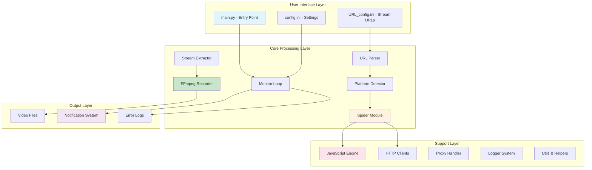
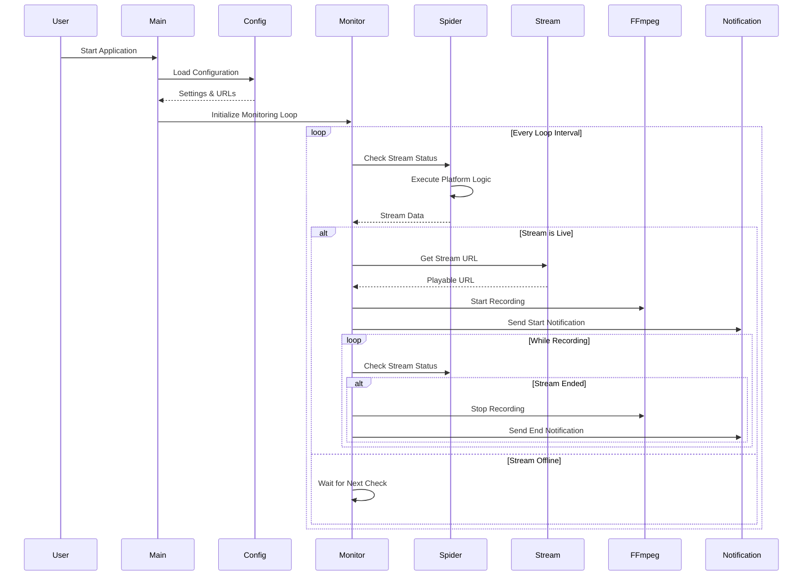
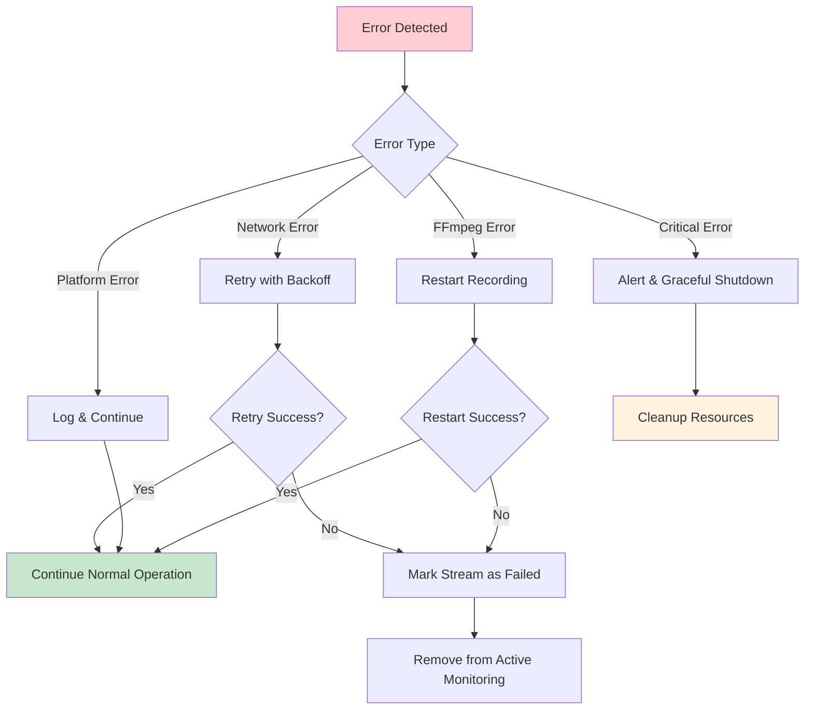
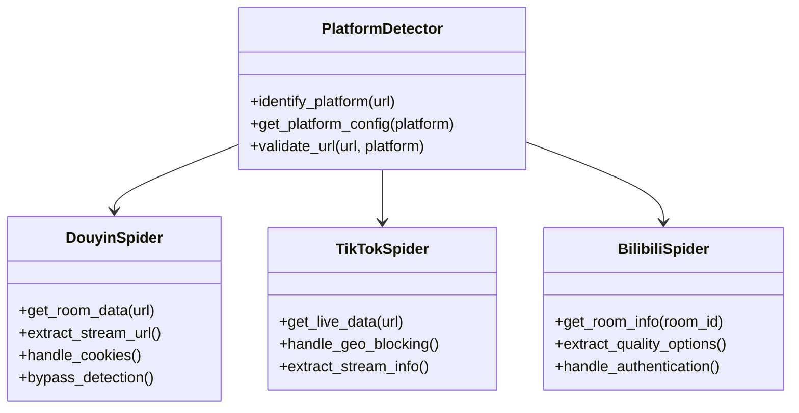
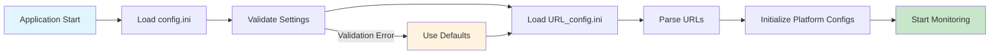
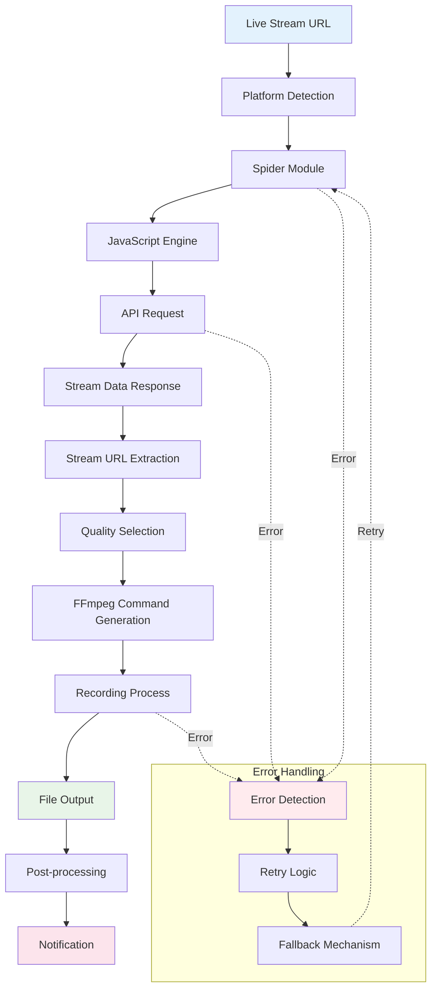
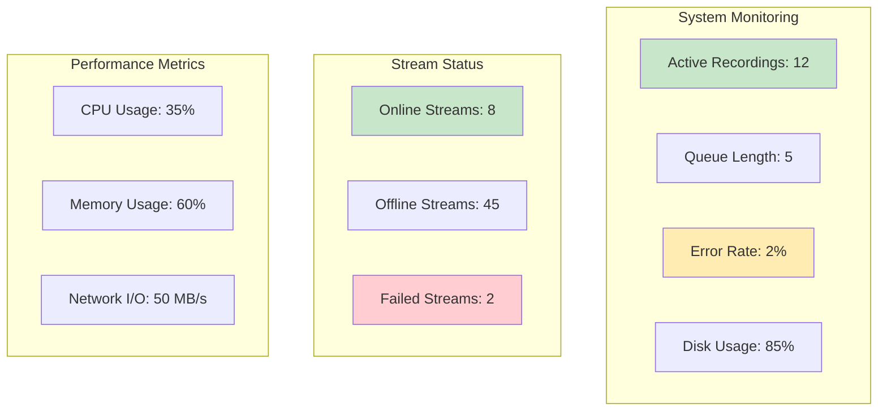

# DouyinLiveRecorder - Project Analysis & Architecture

## 📋 Table of Contents
1. [Project Overview](#project-overview)
2. [Architecture Overview](#architecture-overview)
3. [Core Components](#core-components)
4. [Workflow Analysis](#workflow-analysis)
5. [Platform Support](#platform-support)
6. [Technical Implementation](#technical-implementation)
7. [Configuration System](#configuration-system)
8. [Data Flow](#data-flow)
9. [Error Handling & Monitoring](#error-handling--monitoring)
10. [Installation & Dependencies](#installation--dependencies)

---

## 🎯 Project Overview

**DouyinLiveRecorder** is a sophisticated, multi-platform live stream recording tool designed to automatically monitor and record live streams from 50+ platforms. Built with Python 3.10+ and leveraging FFmpeg for video processing, it provides a robust solution for archiving live content with minimal user intervention.

### Key Features
- **Multi-Platform Support**: 50+ platforms including Douyin, TikTok, Bilibili, YouTube, Twitch, etc.
- **Automated Monitoring**: Continuous loop monitoring with configurable intervals
- **Quality Selection**: Multiple video quality options per platform
- **Proxy Support**: Built-in proxy handling for international platforms
- **Real-time Notifications**: Push notifications via multiple channels (WeChat, DingTalk, Email, etc.)
- **Robust Error Handling**: Graceful error recovery and logging
- **Container Support**: Docker deployment ready
- **Anti-Detection**: JavaScript-based bypass mechanisms

---

## 🏗️ Architecture Overview



---

## 🔧 Core Components

### 1. **Main Controller** (`main.py`)
- **Purpose**: Orchestrates the entire recording workflow
- **Key Functions**:
  - Configuration loading and validation
  - Multi-threaded monitoring loop
  - FFmpeg process management
  - Error handling and recovery
  - Resource cleanup

### 2. **Spider Module** (`src/spider.py`)
- **Purpose**: Platform-specific data extraction
- **Key Functions**:
  - Live stream detection
  - Metadata extraction (title, streamer name, quality options)
  - API interaction with platform-specific endpoints
  - Anti-bot mechanism bypass

### 3. **Stream Module** (`src/stream.py`)
- **Purpose**: Stream URL processing and quality selection
- **Key Functions**:
  - M3U8 playlist parsing
  - Quality mapping and selection
  - Stream URL validation
  - Bandwidth optimization

### 4. **Room Module** (`src/room.py`)
- **Purpose**: Room/channel identification and URL processing
- **Key Functions**:
  - URL parsing and normalization
  - Room ID extraction
  - User ID resolution
  - Platform-specific URL handling

### 5. **JavaScript Engine** (`src/javascript/`)
- **Purpose**: Client-side algorithm execution
- **Components**:
  - `x-bogus.js`: Douyin/TikTok signature generation
  - `crypto-js.min.js`: Cryptographic operations
  - Platform-specific decryption algorithms

### 6. **HTTP Clients** (`src/http_clients/`)
- **Purpose**: Network communication handling
- **Features**:
  - Async HTTP/2 support
  - Proxy integration
  - Cookie management
  - Timeout handling
  - Error recovery

### 7. **Notification System** (`msg_push.py`)
- **Purpose**: Real-time status notifications
- **Supported Platforms**:
  - DingTalk (钉钉)
  - WeChat (微信)
  - Telegram
  - Email (SMTP)
  - Bark (iOS)
  - Ntfy
  - PushPlus

---

## 🔄 Workflow Analysis

### Primary Workflow



### Error Handling Flow



---

## 🌐 Platform Support

### Supported Platforms (50+)

#### Chinese Platforms
- **Douyin** (抖音) - Short video platform with live streaming
- **Kuaishou** (快手) - Competitor to Douyin
- **Bilibili** (B站) - Video sharing and live streaming
- **Huya** (虎牙) - Gaming-focused streaming
- **Douyu** (斗鱼) - Gaming and entertainment streaming
- **YY** - Voice and video social platform
- **Xiaohongshu** (小红书) - Lifestyle and social platform

#### International Platforms
- **TikTok** - International version of Douyin
- **YouTube** - Google's video platform
- **Twitch** - Amazon's gaming streaming platform
- **And 40+ more platforms**

### Platform-Specific Implementation



---

## ⚙️ Technical Implementation

### Technology Stack

| Component | Technology | Purpose |
|-----------|------------|---------|
| **Runtime** | Python 3.10+ | Core application runtime |
| **Async Framework** | asyncio, httpx | Concurrent request handling |
| **Video Processing** | FFmpeg | Stream recording and processing |
| **JavaScript Engine** | PyExecJS | Client-side algorithm execution |
| **HTTP Client** | httpx (HTTP/2) | Network communications |
| **Configuration** | ConfigParser | Settings management |
| **Logging** | Loguru | Advanced logging system |
| **Containerization** | Docker | Deployment and isolation |

### Key Algorithms

#### 1. **X-Bogus Algorithm** (Douyin/TikTok)
```javascript
// Simplified version of the signature generation
function generateXBogus(query, userAgent) {
    // Complex calculation involving query parameters and user agent
    // Returns anti-bot signature for API requests
    return signature;
}
```

#### 2. **Stream Quality Selection**
```python
QUALITY_MAPPING = {
    "OD": 0,    # Original Definition
    "BD": 0,    # Blue-ray Definition  
    "UHD": 1,   # Ultra High Definition
    "HD": 2,    # High Definition
    "SD": 3,    # Standard Definition
    "LD": 4     # Low Definition
}
```

#### 3. **Retry Mechanism**
```python
@trace_error_decorator
async def retry_with_backoff(func, max_retries=3, base_delay=1):
    for attempt in range(max_retries):
        try:
            return await func()
        except Exception as e:
            if attempt == max_retries - 1:
                raise e
            await asyncio.sleep(base_delay * (2 ** attempt))
```

---

## 📊 Configuration System

### Configuration Files Structure

#### `config/config.ini`
```ini
[录制设置]
language = zh_cn
视频保存格式 = ts
原画|超清|高清|标清|流畅 = 原画
循环时间(秒) = 300
分段录制是否开启 = 是
录制完成后自动转为mp4格式 = 是

[推送配置]
直播状态推送渠道 = 微信,钉钉
钉钉推送接口链接 = https://...
微信推送接口链接 = https://...

[Cookie]
抖音cookie = ttwid=1%7CB1qls3GdnZhUov9o2NxOMxxYS2ff6OSvEWbv0ytbES4...
快手cookie = 
tiktok_cookie = 
```

#### `config/URL_config.ini`
```ini
# 添加要录制的直播间地址，一行一个
# 格式：[画质,]URL
# 示例：
超清,https://live.douyin.com/745964462470
https://www.tiktok.com/@pearlgaga88/live
https://live.bilibili.com/320
# 注释的链接不会被录制
#https://live.kuaishou.com/u/yall1102
```

### Configuration Loading Process



---

## 📈 Data Flow

### Recording Data Flow



### File Organization

```
downloads/
├── douyin/
│   ├── streamer_name_1/
│   │   ├── 2024-01-15_20-30-00_stream_title.ts
│   │   ├── 2024-01-15_20-30-00_stream_title.mp4
│   │   └── 2024-01-15_20-30-00_stream_title.srt
│   └── streamer_name_2/
├── bilibili/
├── youtube/
└── tiktok/
```

---

## 🛡️ Error Handling & Monitoring

### Error Categories and Responses

| Error Type | Handling Strategy | Recovery Action |
|------------|------------------|----------------|
| **Network Timeout** | Retry with exponential backoff | Reconnect with different endpoint |
| **Platform API Error** | Log and continue | Skip current check cycle |
| **FFmpeg Process Error** | Restart recording process | Save partial recording |
| **Authentication Error** | Refresh cookies/tokens | Use fallback authentication |
| **Disk Space Error** | Stop new recordings | Alert administrator |
| **Memory Error** | Reduce concurrent streams | Restart with lower limits |

### Monitoring Dashboard



---

## 📦 Installation & Dependencies

### System Requirements

- **Python**: 3.10 or higher
- **FFmpeg**: Latest stable version
- **Node.js**: For JavaScript execution (PyExecJS)
- **Operating System**: Windows, Linux, macOS
- **Memory**: Minimum 4GB RAM
- **Storage**: 10GB+ for recordings

### Dependencies Analysis

```python
# requirements.txt
requests>=2.31.0        # HTTP requests
loguru>=0.7.3          # Advanced logging
pycryptodome>=3.20.0   # Cryptography
distro>=1.9.0          # OS detection
tqdm>=4.67.1           # Progress bars
httpx[http2]>=0.28.1   # Async HTTP client
PyExecJS>=1.5.1        # JavaScript execution
```

### Installation Methods

#### 1. **Source Installation**
```bash
git clone https://github.com/ihmily/DouyinLiveRecorder.git
cd DouyinLiveRecorder
pip install -r requirements.txt
python main.py
```

#### 2. **Docker Installation**
```bash
docker-compose up -d
```

#### 3. **Binary Release**
Download pre-compiled executables from GitHub Releases

---

## 🔮 Advanced Features

### 1. **Intelligent Quality Selection**
- Automatic bandwidth detection
- Quality degradation on network issues
- Platform-specific quality mapping

### 2. **Anti-Detection Mechanisms**
- User-Agent rotation
- Request timing randomization
- JavaScript-based signature generation
- Cookie management and refresh

### 3. **Scalability Features**
- Multi-threaded processing
- Configurable concurrency limits
- Resource usage monitoring
- Automatic cleanup

### 4. **Integration Capabilities**
- REST API for external control
- Webhook notifications
- Custom script execution
- Database logging support

---

## 🏁 Conclusion

DouyinLiveRecorder represents a sophisticated approach to automated live stream recording, combining robust technical architecture with user-friendly configuration. Its modular design allows for easy extension to new platforms while maintaining reliability and performance across diverse streaming environments.

The project demonstrates advanced techniques in:
- **Web Scraping**: Anti-bot bypass mechanisms
- **Concurrent Programming**: Async/await patterns
- **Video Processing**: FFmpeg integration
- **System Integration**: Cross-platform compatibility
- **Error Recovery**: Graceful degradation strategies

This analysis provides a comprehensive foundation for understanding, maintaining, and extending the DouyinLiveRecorder project.

---

*Generated on: 2024-01-15*  
*Analyzer: Project Analysis Tool*  
*Version: 4.0.6*
